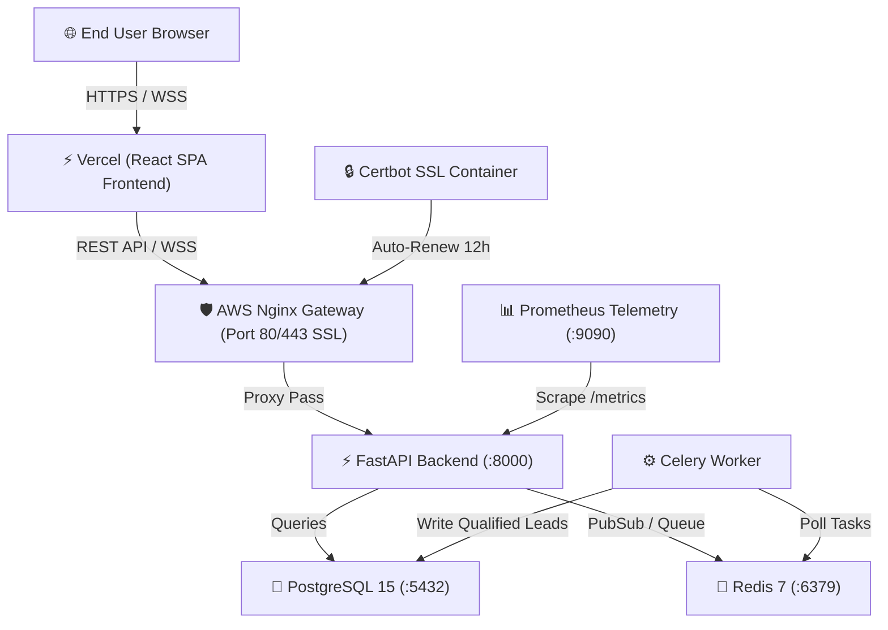

# 🚀 Enterprise Production Deployment Guide (AWS + Vercel)
### Premium AI Lead Generation SaaS Platform — Forward Deployed Engineer (FDE) Spec

This guide explains how to deploy the **Backend Microservices Stack on AWS** (using Docker Compose, Nginx SSL, PostgreSQL, Redis, Celery) and the **React Frontend on Vercel**, and seamlessly connect them.

---

## 🏗️ Architecture Overview



---

## 🔹 STEP 1: Deploy Backend Stack on AWS EC2 / Lightsail

### 1.1 Provision AWS Instance & Security Group
1. Launch an **Ubuntu 22.04 LTS** EC2 instance (`t3.medium` or `t3.large` recommended).
2. Configure **Security Group Inbound Rules**:
   - `HTTP` (Port 80) → `0.0.0.0/0`
   - `HTTPS` (Port 443) → `0.0.0.0/0`
   - `SSH` (Port 22) → `Your IP`
3. Allocate and attach an **AWS Elastic IP** to ensure your server IP never changes.

### 1.2 Point Domain DNS to AWS Elastic IP
In your domain registrar (GoDaddy, Namecheap, Cloudflare):
- Create an **A Record**: `api.yourdomain.com` ➔ `YOUR_AWS_ELASTIC_IP`

### 1.3 SSH into AWS Instance & Install Docker
```bash
ssh -i "your-key.pem" ubuntu@YOUR_AWS_ELASTIC_IP

# Update packages and install Docker + Docker Compose
sudo apt update && sudo apt upgrade -y
sudo apt install -y docker.io docker-compose-v2 git
sudo systemctl enable --now docker
sudo usermod -aG docker $USER
newgrp docker
```

### 1.4 Clone Repository & Configure Environment Variables
```bash
git clone https://github.com/MuneebMalik244535/Premiumaileadgenplatform.git
cd Premiumaileadgenplatform

# Create Production Environment File
nano .env
```

Paste your production secrets into `.env`:
```env
POSTGRES_USER=leadgen_prod_user
POSTGRES_PASSWORD=SuperSecretProdPassword99!
POSTGRES_DB=leadgen_prod_db
JWT_SECRET_KEY=prod-jwt-secret-key-change-me-778899
ADMIN_USERNAME=admin@yourdomain.com
ADMIN_PASSWORD=AdminSecurePassword123!
GEMINI_API_KEY=your_google_gemini_api_key
SERPAPI_API_KEY=your_serpapi_key
ALLOWED_ORIGINS=https://your-app.vercel.app,https://yourdomain.com,https://www.yourdomain.com
USE_CELERY=true
SENTRY_DSN=your_sentry_dsn_optional
```

### 1.5 Generate HTTPS / SSL Certificates with Certbot
Update `domains` in `init-letsencrypt.sh` to `api.yourdomain.com` and run:
```bash
chmod +x init-letsencrypt.sh
./init-letsencrypt.sh
```

### 1.6 Launch 8-Microservice Backend Stack
```bash
docker compose up -d --build

# Verify all 8 containers are running cleanly
docker compose ps
```

Verify backend health at: `https://api.yourdomain.com/healthz` ➔ `{"status": "healthy"}`

---

## 🔹 STEP 2: Deploy React Frontend on Vercel

### 2.1 Connect GitHub Repo to Vercel
1. Go to [Vercel Dashboard](https://vercel.com/dashboard) and click **"Add New" ➔ "Project"**.
2. Import your GitHub repository: `MuneebMalik244535/Premiumaileadgenplatform`.
3. Set **Root Directory**: `frontend`.

### 2.2 Configure Build & Output Settings
- **Framework Preset**: Vite
- **Build Command**: `npm run build`
- **Output Directory**: `dist`

### 2.3 Set Environment Variables on Vercel
In Vercel **Environment Variables** tab, add:
- `VITE_API_BASE_URL` = `https://api.yourdomain.com/api`
- `VITE_WS_URL` = `wss://api.yourdomain.com/api/ws`

### 2.4 Deploy
Click **Deploy**! Vercel will build your SPA and generate your live frontend URL (e.g. `https://leadgen-platform.vercel.app`).

---

## 🔹 STEP 3: Connect Frontend (Vercel) with Backend (AWS)

### 3.1 Verify CORS Allowed Origins
On your AWS EC2 instance, ensure `.env` includes your exact Vercel URL:
```env
ALLOWED_ORIGINS=https://leadgen-platform.vercel.app,https://yourdomain.com
```

If you update `.env`, restart the backend container:
```bash
docker compose restart backend
```

### 3.2 Test Connection Checklist
1. Open `https://leadgen-platform.vercel.app/login` in your browser.
2. Sign in with `admin@yourdomain.com` / `AdminSecurePassword123!`.
3. Open Browser DevTools (F12) ➔ Network tab:
   - Check `POST https://api.yourdomain.com/api/auth/login` returns `200 OK` with JWT token.
   - Check WebSocket connection `wss://api.yourdomain.com/api/ws` connects cleanly for live log streaming.

---

## 🛠️ Operational Maintenance Commands

| Action | AWS Terminal Command |
| :--- | :--- |
| **Check Container Logs** | `docker compose logs -f backend celery_worker` |
| **Check Prometheus Metrics** | `curl https://api.yourdomain.com/metrics` |
| **Restart Stack** | `docker compose restart` |
| **Pull & Deploy Updates** | `git pull && docker compose up -d --build` |
